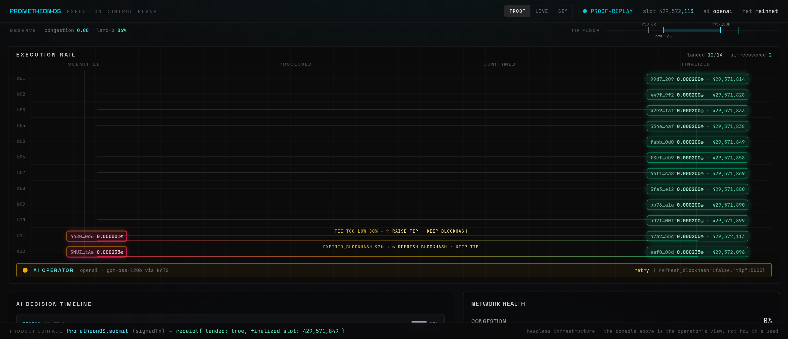

# PrometheonOS

**Autonomous Solana Execution Intelligence Engine.**

PrometheonOS observes the Solana network in real time, submits transactions intelligently as
Jito bundles, tracks their lifecycle across every commitment level, classifies failures, and
lets an AI strategist make and **explain** real operational decisions (proposing tips, submission
timing, and owning the autonomous-retry decision). It is built to feel like an internal **execution
control plane** used by a professional Solana infrastructure team — the layer that decides and recovers
*above* the transport (Jito / Sender / BDN) and fee estimators it consumes — not a transaction sender
with an LLM bolted on.

> Built for the Superteam Nigeria *Advanced Infrastructure Challenge — Build a Smart Transaction Stack*.

---

## The AI decision it owns — Autonomous Retry with Fault Injection

The agent **drives the recovery** of a failed bundle. We deliberately inject a blockhash-expiry (and
a sub-floor tip); when a bundle doesn't land, the deterministic core **classifies** the failure from
the stream and asks the agent — over NATS — *how to recover*. The agent reasons in plain English and
returns the concrete levers the engine then acts on: the new **tip** (read from `after.tip`, enforced
by the contract) and whether to **refresh the blockhash** (`after.refresh_blockhash`); the core
**resubmits the next attempt**, which lands.

**Honest division of authority:** the agent owns the **autonomous-retry decision** — on a failure it
chooses *which lever* to pull (refresh the blockhash vs. raise the tip), causally enforced by a contract
that **rejects** any reply omitting `after.tip` / `after.refresh_blockhash` — and it **proposes** the
per-bundle tip, with visible reasoning. The deterministic core owns the **safety envelope**: it decides
retry-vs-abandon and the attempt cap (`prometheon-retry`), **always** forces a blockhash refresh on a
true expiry (the model can add one, never remove it), and clamps every tip to a **competitive
`[200_000, 1_000_000]`-lamport band** before signing. That floor is load-bearing and we say so plainly:
in the committed mainnet run, most AI tip *proposals* came in below the 200k competitive floor and were
lifted to it — the safety envelope working as designed — so the floor, not the model's exact number,
sets the tip when the AI under-prices. The AI's *provable, outcome-changing* lever is therefore the
retry decision itself (the `refresh_blockhash` binary and the choice of which lever to pull), not the
precise tip economics. This is a genuine reasoned decision in the loop — not sequential automation —
with the core as a safety envelope the model cannot override. The agent also makes a **submission-timing** call from the live leader
schedule. Every decision persists its full `{inputs, reasoning, confidence, action, before/after}`
trace, renders on the live dashboard timeline, and is exported into the lifecycle log. The saga +
recovery are regression-tested end-to-end without a network in
[`crates/prometheon-core/tests/saga_pipeline.rs`](crates/prometheon-core/tests/saga_pipeline.rs); the
agent's causal contract (it must emit `after.tip`/`after.refresh_blockhash` or the reply is rejected,
never silently treated as a decision) is enforced in `ai-agent` and tested there.

## Why this is different

**It's an execution *control plane*, not a transaction sender.** Everyone else sells a faster *pipe*
(Jito Block Engine, Helius Sender, bloXroute BDN) or a *tip number* (Helius `getPriorityFeeEstimate`,
Triton). PrometheonOS sits **above** them — it reads *why* a bundle failed off the stream and reasons it
back to a finalized landing. It **consumes** transport + estimators; it does not replace them.

```
  Estimators   │  Helius getPriorityFeeEstimate · Triton            ┐
  Transport    │  Jito Block Engine · Helius Sender · bloXroute BDN  ┘ ← consumed
  ─────────────┼──────────────────────────────────────────────────────────────
  PrometheonOS │  CONTROL PLANE:  classify failure → decide (refresh vs. re-price) → recover to landing
```

- **AI genuinely in the loop** — the agent makes the autonomous-retry *decision* (which lever to pull)
  and proposes the tip *during* the run; the recovered failure shows attempt 1 (classified failure) →
  attempt 2 (landed) as a linked **recovery chain** in the log.
- **AI reasons over network state, not a constant** — given congestion `0.62` it targets the P75–P95
  band (≈26,000 lamports); given an `ExpiredBlockhash` it returns `refresh_blockhash:true` (see
  [`logs/ai-decision-trace.md`](logs/ai-decision-trace.md) — an illustrative agent trace, a separate run
  from the committed mainnet proof). Different inputs → different, defensible levers.
- **Network Health Model** — a live network-condition intelligence layer (congestion, slot
  stability, leader reliability, confirmation-latency variance, bundle landing probability,
  expiry risk) that the AI consumes.
- **Stream-confirmed lifecycle** — landing is confirmed from the **Yellowstone gRPC stream**
  (slot status + tx-status), with RPC only as a cross-check.
- **Dynamic tips + a competitive floor (stated honestly)** — tips are computed from live Jito tip-floor
  percentiles + current conditions, then clamped to a **competitive `[200_000, 1_000_000]`-lamport
  band**; a sub-floor AI proposal is *lifted* to the floor so the bundle reliably lands. In the proof
  run the floor — not the model's exact number — set most tips; that's the deterministic safety envelope
  working, and the AI's provable lever is the retry decision (the `refresh_blockhash` binary).
- **Real leader-window detection** — the upcoming leader schedule from RPC `getSlotLeaders` drives a
  submission-timing decision (the Jito searcher `getNextScheduledLeader` is a gRPC searcher method
  needing approved auth; we time against the RPC schedule and let the Block Engine route to the next
  Jito leader).
- **Visible AI reasoning** — every decision persists `{inputs, reasoning, confidence, action,
  before/after}`, renders on a live decision timeline, and is included in the exported log.
- **Deliberate chaos** — fault injection (blockhash expiry, low tip, …) exercises the AI's
  adaptation; the recovery is captured in the lifecycle log + decision timeline.

## Control room — watch the AI self-heal



_The Recovery Rail (proof-replay of the committed mainnet run). `b11` under-tipped → the AI **raises the
tip**; `b12` expired-blockhash → the AI **refreshes the blockhash** — two failures, two correct levers,
both recovered to finalized slots. A 35 s screen capture is in
[`docs/assets/recovery-rail-demo.mp4`](docs/assets/recovery-rail-demo.mp4)._

The dashboard is the **operator's control room** (and the demo surface), not the product — the product
is a **real callable surface** (a Rust library fn + a `submit` CLI + a loopback HTTP endpoint) that hands
the engine a strategy and returns a lifecycle receipt:
`submit(SubmitRequest) → Receipt{ Landed{slot, final_stage, attempts} | Failed{reason, last_class, attempts} }`
(engine-custody — the engine signs, tips, tracks, and autonomously retries; see
[`docs/INTEGRATION.md`](docs/INTEGRATION.md)). The pinned receipt strip shows that contract. It's one
full-bleed instrument, the **Recovery Rail**: each committed
mainnet bundle is a token riding four stations (Submitted→Processed→Confirmed→Finalized); the two injected
failures visibly detour — rose fault token, the AI's classified lever inline (`fee_too_low → ↑ raise tip`;
`expired_blockhash → ↻ refresh blockhash`), the **AI OPERATOR** node pulsing — and recover to a finalized
landing whose slot **links to the explorer**. Two failures, two divergent correct levers: the causal
contract, legible at a glance. Hover a recovery row to spotlight its decision + reasoning in the timeline.

```bash
pnpm --filter @prometheon/dashboard dev     # → http://localhost:3000  (defaults to the proof-replay)
```

It has three **honest** sources — a `live | simulated | proof-replay` toggle. `proof-replay`
deterministically replays the *committed* mainnet run (real on-chain data + real explorer links), so the
self-heal plays on cue without faking liveness. Scrub the demo with `?t=<ms>` — e.g. `/?t=34500` parks on
the frame where **both** recoveries have healed to finalized, explorer-linked slots (the money shot).

**Why a replay is the default (and still honest):** a live mainnet run is sparse and slow, so the hero
won't fire on cue — so the dashboard *defaults* to the deterministic `proof-replay` (real committed data,
real explorer links, **never** badged `live`). The **`live`** source is first-class: it subscribes to the
engine's telemetry over NATS and renders in real time; if no fresh event arrives within ~15 s it falls
back to `simulated` rather than show a stale feed, so the `live` badge is always truthful. Nothing is
faked and nothing is hidden — the badge always tells you exactly what you're watching.

## Architecture (high level)

Rust core engine (ingest · bundle · lifecycle · failure · retry · netmodel · telemetry ·
faultinject) ⇄ **NATS** ⇄ TypeScript AI agent (pluggable Anthropic / OpenAI / Ollama) and a
Next.js realtime dashboard, with Postgres + TimescaleDB persistence and Prometheus metrics.

**Key design rule:** the LLM is an asynchronous *strategist* (sets policy, reasons about
failures) — it is **never** in the sub-second leader-window hot path, which stays deterministic
in Rust.

> **Full architecture document (public):**
> [crystalline-koi-7f8.notion.site/ARCHITECTURE-PUBLIC](https://crystalline-koi-7f8.notion.site/ARCHITECTURE-PUBLIC-38faa89d75a18064b1dffd857154b272)
> — in-repo source: [`docs/ARCHITECTURE-PUBLIC.md`](docs/ARCHITECTURE-PUBLIC.md) · [`docs/ARCHITECTURE.md`](docs/ARCHITECTURE.md).
> **Demo video (35 s):** [`docs/assets/recovery-rail-demo.mp4`](https://github.com/Blessedbiello/PrometheonOS/blob/main/docs/assets/recovery-rail-demo.mp4).

## Repository layout

```
crates/        Rust workspace (engine)
ai-agent/      TypeScript AI agent (pluggable LLM provider)
dashboard/     Next.js realtime UI
contracts/     JSON Schema (generated from Rust) + generated TS types
infra/         docker-compose: NATS, Postgres+Timescale, Prometheus
docs/          ARCHITECTURE · INTEGRATION · FAILURE-TAXONOMY · TELEMETRY-SCHEMA · EXPERIMENTS · RFCs
scripts/       proof run + lifecycle-log export
logs/          exported lifecycle logs (explorer-verifiable slots)
```

## Setup

> Prerequisites: Rust (stable ≥1.80), Node 20+, pnpm, Docker.

```bash
cp .env.example .env          # fill in RPC / Yellowstone / Jito / wallet / LLM keys
docker compose -f infra/docker-compose.yml up -d   # NATS, Postgres+Timescale, Prometheus
cargo build                   # build the engine
cargo test                    # unit suite (no network)
```

### Infrastructure preflight

A one-command connectivity check validates everything the engine needs and prints a ✓/✗ report:

```bash
cargo run -p prometheon-core --bin preflight
```

It checks Solana RPC health + wallet balance, Jito tip-floor reachability, and (once configured)
a live Yellowstone slot stream. Use it to confirm your environment before running the engine.

## Running it

With `.env` filled and infra up:

```bash
# 1. Engine — streams Yellowstone slots → network-health model → telemetry sinks
#    (NATS pub/sub, Postgres/Timescale, Prometheus /metrics on :9100).
cargo run -p prometheon-core --bin prometheon

# 2. AI agent — pluggable strategist serving decision.request.* over NATS.
#    LLM_PROVIDER=anthropic|openai|ollama|mock  (mock needs no API key).
LLM_PROVIDER=mock pnpm --filter @prometheon/ai-agent start

# 3. Dashboard — the "Recovery Rail" control room (defaults to the committed proof-replay; toggle
#    live | simulated | proof-replay). See "Control room" above.
pnpm --filter @prometheon/dashboard dev          # http://localhost:3000  (try /?t=34500 for the money shot)

# 4. Proof — assemble + simulate (free dry-run) or submit + stream-track (live) N bundles, with
#    deterministic injected failures. The live run persists Bundle/Lifecycle/Failure telemetry.
NETWORK=mainnet cargo run -p prometheon-core --bin proof -- --count 12                  # dry-run
NETWORK=mainnet ./scripts/run-proof.sh 12 low-tip:1,stale-blockhash:1                   # live (funded wallet)

# 5. Lifecycle log — export the persisted bundles to logs/lifecycle-log.{json,md}.
cargo run -p prometheon-telemetry --bin export-log
```

Regenerate the cross-language contract after changing a Rust telemetry type:

```bash
./scripts/gen-contracts.sh      # Rust (schemars) → contracts/json-schema → contracts/ts
```

### Submit → Receipt — the product surface

The dashboard is optional; PrometheonOS is **headless infrastructure**. Hand the engine a strategy and
get a lifecycle receipt back — as a Rust library call, a CLI, or a loopback HTTP endpoint:

```bash
# CLI: submit a strategy, print the Receipt JSON (devnet is free; mainnet needs a funded wallet)
NETWORK=mainnet cargo run -p prometheon-core --bin submit -- --transfer-lamports 1 --max-attempts 3

# HTTP: serve POST /submit on loopback (127.0.0.1:9180), then curl it
NETWORK=mainnet cargo run -p prometheon-core --bin submit -- --serve
curl -s 127.0.0.1:9180/submit -d '{"transfer_lamports":1,"max_attempts":3,"deadline_secs":180}'
# → {"outcome":"landed","slot":429572113,"final_stage":"finalized","attempts":2}
```

The engine signs (engine-custody), tips, tracks the lifecycle over one Yellowstone stream, and
autonomously retries — returning `Receipt::Landed{slot, final_stage, attempts}` or
`Receipt::Failed{reason, last_class, attempts}`, **derived from the same telemetry as the lifecycle log**
(so a receipt reconciles with the exported log). The HTTP endpoint binds **loopback-only** and is
unauthenticated by design (it signs with a funded wallet). Full guide — including the
`Submitter`/`DecisionSource`/`run_saga` seam for deep integration — in
[`docs/INTEGRATION.md`](docs/INTEGRATION.md).

## Status

**Validated live (read-only spine).** Ingestion → network-health model → NATS / Postgres /
Prometheus sinks → dashboard, against the SolInfra mainnet stream; plus the AI strategist (tip
decision proven end-to-end over NATS).

**Integration-tested (AI-in-the-loop submit pipeline).** The full path — AI tip decision → submit →
stream-confirmed lifecycle → on failure **classify → AI retry decision → refresh + re-price →
resubmit to landing** → `Bundle`/`Lifecycle`/`Failure`/`Decision` telemetry → Postgres →
lifecycle-log export (with an AI Decision Timeline) — is covered end-to-end, **without a network**, by
`prometheon-core/tests/saga_pipeline.rs` (asserts ≥10 landed, ≥2 classified failures the agent
recovers, and a retry decision with visible reasoning) and `proof_pipeline.rs`. The assembly path is
additionally dry-run validated on mainnet (dynamic tip from live floor, rotating tip accounts, fresh
blockhash + signature; only broadcast needs funding). ~187 Rust + 51 TS tests; CI runs fmt · clippy ·
tests · schema-drift · TS typecheck + tests · dependency audit.

**Proven on mainnet — the funded proof run is committed.** `./scripts/run-proof.sh` opened **one**
Yellowstone stream and submitted bundles **including ≥2 deterministically-injected failures**
(`--inject low-tip:1,stale-blockhash:1`), stream-confirmed each lifecycle, persisted the telemetry, and
exported [`logs/lifecycle-log.{json,md}`](logs/lifecycle-log.md). The committed run:
**12 bundles landed, 2 failed of 14 submissions** — every landed bundle advancing
`submitted→processed→confirmed→finalized`, slots **verifiable on the explorer** (e.g.
[429572113](https://explorer.solana.com/block/429572113)), submit→confirmed deltas of **~0.4–1.8 s** for
most landings (max ~5 s; the two AI-recovered attempts confirmed in **0.65 s and 0.82 s**), and **15 real AI
decisions, all by the agent** (Groq `gpt-oss-120b` via the OpenAI-compatible provider; 1 timing + 12
tip + 2 retry) in the log's AI Decision Timeline. Both injected faults were classified from real signals —
the sub-floor tip as **`fee_too_low`**, the expired blockhash as **`expired_blockhash`** — and each was
**recovered to landing by the AI retry decision** (re-price / refresh + resubmit). It must be mainnet — Jito has no
devnet Block Engine and the SolInfra stream is mainnet; the free dry-run validates the same assembly
path without funds.

## README questions (answered from real telemetry)

**1. What does the delta between `processed_at` and `confirmed_at` tell you about network health?**

It is the time for a block we have *already seen* (`processed` — in a block, no votes yet,
fork-revertible) to gather a ≥⅔ stake-weighted optimistic vote (`confirmed`). That makes it a
direct read on **consensus health**, not just latency: a small, stable delta (typically
sub-second to ~1–2 s) means high voting participation, a single canonical fork, and votes landing
promptly. A *widening* or high-variance delta is an early warning of lagging vote propagation, fork
contention, or congestion — it appears here *before* it shows up as outright failures. That's why
the network-health model tracks `confirm_latency_variance_ms` and folds it into the
`congestion_score` the AI strategist reasons over.

> Provenance: confirmed by the committed funded run — [`logs/lifecycle-log.md`](logs/lifecycle-log.md)
> records real per-bundle submit→confirmed deltas of **~0.4–1.8 s** for most of the mainnet landings
> (small and stable, exactly the healthy regime described above; max ~5 s, and the two AI-recovered
> attempts confirmed in 0.65 s and 0.82 s), each advancing `processed → confirmed → finalized` with
> explorer-verifiable slots.

**2. Why should you never use `finalized` commitment when fetching a blockhash for a time-sensitive transaction?**

A `finalized` blockhash is already ~31–32 slots (~12.8 s) old when you receive it. Blockhash
validity is a fixed **150-block budget measured from block production, not from when you fetch it** —
so starting from a `finalized` blockhash pre-spends ~20–30% of the window (≈118 usable blocks ≈
47–71 s instead of the full ~60–90 s) for **zero benefit**, sharply raising "blockhash not found" /
expiry risk. Fetch at `confirmed` (or `processed` for maximum runway) and reserve `finalized` for
reading settled state. Our RPC client fetches at `confirmed` for exactly this reason, and expiry is
measured by **block height** (skipped slots don't burn the budget) via `getBlockHeight` +
`isBlockhashValid` — see `prometheon-core::rpc`.

**3. What happens to your bundle if the Jito leader skips their slot?**

The bundle does **not** land (a bundle is atomic — all-or-nothing within one block), the tip is
**not** paid (the tip transfer is co-located in the same transaction as the strategy logic, so a
non-landing costs nothing), and the blockhash **stays valid** (a skipped slot doesn't advance block
height, so the 150-block budget is untouched). The correct response is to retry to the *next* Jito
leader. The catch: only a **Jito-Solana** leader honours bundles, so if no Jito leader remains
inside the blockhash window the bundle is effectively dropped and needs a fresh attempt. Our retry
policy encodes precisely this — `leader_miss` / `skipped_slot` are retryable, the tip is recomputed
from current conditions, and the blockhash is refreshed *only* when the window itself has closed
(`prometheon-retry::policy`).

> Provenance: the read-only engine streams real leader skips (slot stability moving off `1.0`, the
> congestion score rising in response), and the committed funded run exercised the retry path for real —
> both injected faults (a sub-floor tip, an expired blockhash) were classified and **recovered to
> landing by the AI retry decision**, recorded in [`logs/lifecycle-log.md`](logs/lifecycle-log.md).

## License

MIT.
