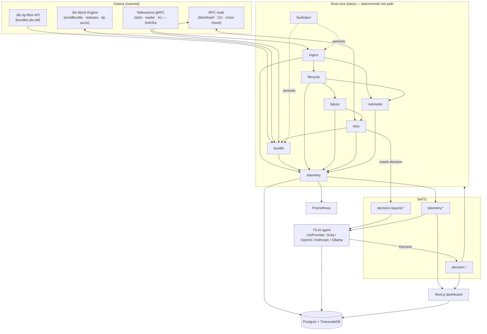
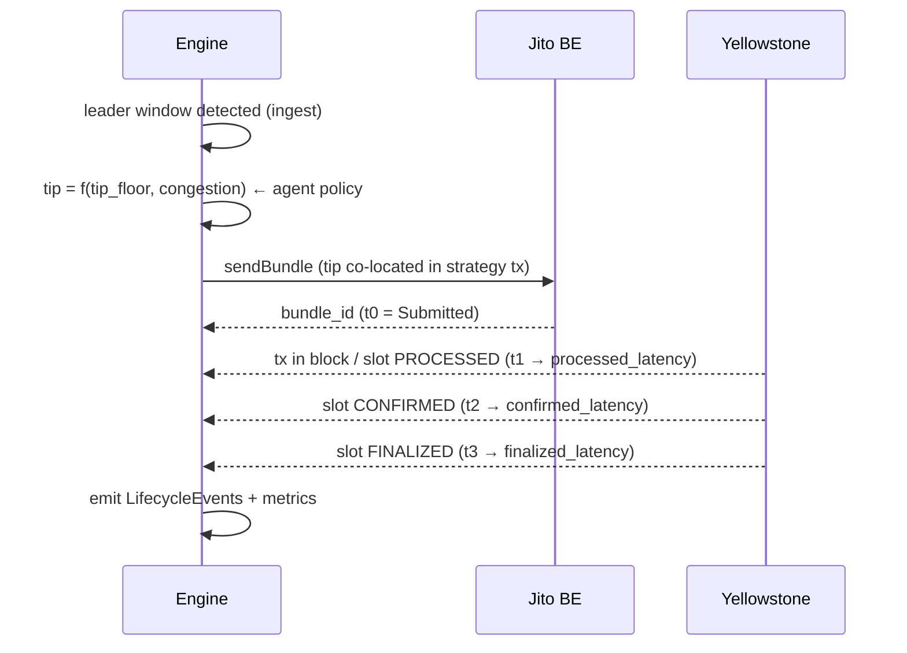
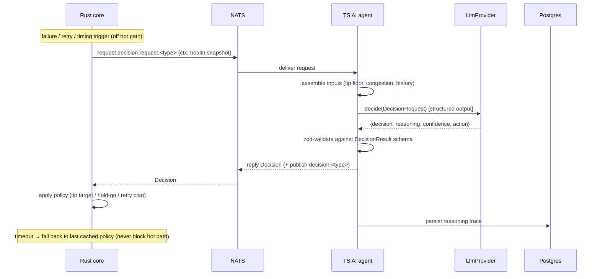
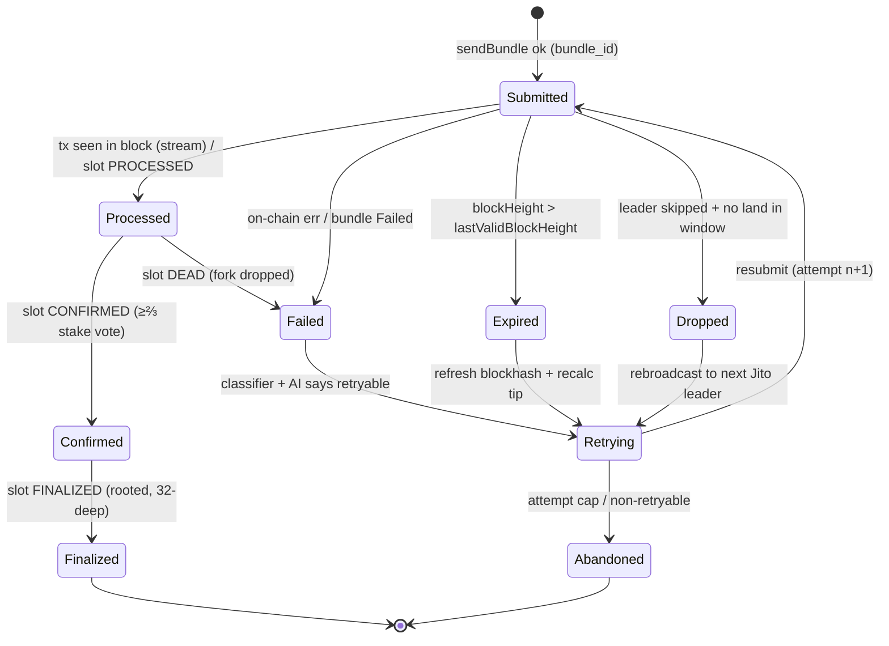
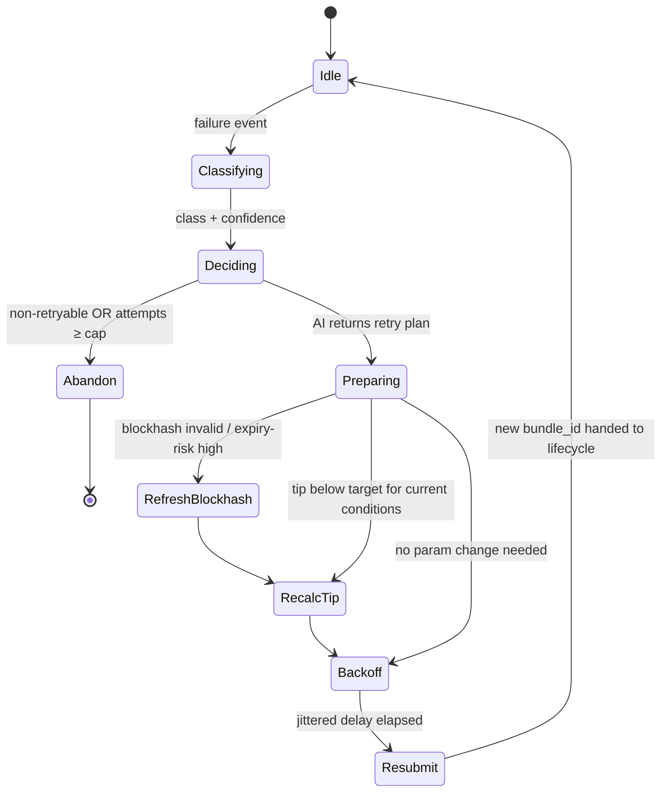

# PrometheonOS — Architecture Design Document

*An autonomous Solana execution-intelligence engine: it streams the network live, submits Jito
bundles with dynamically-priced tips, tracks every transaction across all four commitment levels,
classifies failures from real signals, and lets an AI agent own — and explain — the autonomous
recovery decision. Proven on mainnet.*

---

## Coverage map

| Required area | Where it's answered |
|---|---|
| **System architecture** | §5 System architecture & data flow |
| **Key components** | §6 Component breakdown |
| **Data flow between services** | §5 (diagram) · §7 Event flow · §8 AI decision pipeline |
| **Infrastructure decisions** | §15 Infrastructure decisions · §3 Design philosophy |
| **Failure handling strategy** | §11 Failure handling · §9 Lifecycle state machine · §10 Retry state machine |
| **AI agent responsibilities** | §8 AI decision pipeline · §3 Design philosophy |
| **Operational understanding** | §4 Lifecycle deep dive · §20 Lessons learned · §22 Operational Q&A |
| **Proof it ran on real infra** | §19 Cost · §21 Implementation status & live validation |

---

## 1. Executive summary

On Solana, *sending* a transaction is the easy part. *Landing* a value-critical one — a liquidation,
an oracle update, an arbitrage — during congestion is where money is lost: the transaction expires or
gets crowded out, and the usual "retry" is a dumb loop that re-sends the same expired blockhash with
the same too-low tip until it gives up.

**PrometheonOS is an execution control plane.** It streams live slot/leader data from Yellowstone
gRPC, constructs and submits Jito bundles with dynamically-computed tips, tracks each transaction
across `Submitted → Processed → Confirmed → Finalized`, classifies failures from real signals, and
lets an AI strategist make and explain real operational decisions (tip sizing, submission timing, and
the autonomous retry-with-fault-injection recovery). Landing is confirmed **from the stream**; RPC is
only a cross-check.

## 2. System goals

- **Real protocol fidelity** — no hardcoded shortcuts; correct commitment handling end to end.
- **Total observability** — everything timestamped and measurable; every failure classified; every
  retry and AI decision justified and persisted.
- **Clean separation** between the deterministic core and the AI layer.
- **Production-grade reliability** — supervised reconnection, backpressure, graceful degradation.

## 3. Design philosophy — the AI is a strategist, not in the hot path

An LLM call (~0.5–3 s) cannot sit inside the leader-window catch loop. So the architecture splits in
two:

- **The Rust core is the deterministic hot path** — catch the leader window, build/submit bundles,
  track the lifecycle — and always runs on the *latest policy* the agent has set.
- **The TS AI agent is an asynchronous strategist** — it reacts to telemetry (health snapshots,
  failure/retry events) to set policy (tip target, hold/go) and to reason about discrete,
  non-microsecond-critical events (failure → recovery decision).

If the agent is slow or unreachable, the hot path proceeds on the last cached policy and never blocks.
This is the single most important design decision in the system.

## 4. Solana transaction lifecycle — deep dive

**Commitment levels.** `processed` (in a block, no votes, fork-revertible, ~400–600 ms) → `confirmed`
(≥⅔ stake optimistic vote, ~1–2 s) → `finalized` (32-slot lockout, rooted, ~12.8 s).

**Blockhash validity.** Valid for 150 blocks (~60–90 s); `lastValidBlockHeight = current + 150`.
Expiry is measured by **block height**, so *skipped slots don't burn the budget*.

**TPU pipeline.** fetch (QUIC) → sigverify (dedup) → banking (+PoH) → broadcast (Turbine).

**Why streaming beats polling.** RPC polling only surfaces a transaction *after* replay + vote + RPC
indexing — too late to react inside the window. The stream tells us the moment a slot/tx changes
status, which is why landing is confirmed from Yellowstone, not `getSignatureStatuses`.

## 5. System architecture & data flow

The Rust core ⇄ **NATS** ⇄ {TS AI agent, Next.js dashboard}, with Postgres+TimescaleDB persistence and
a Prometheus metrics exporter. The core is the only component that touches Solana directly.



**Plain-text fallback** (if mermaid doesn't render):

```
Solana ──► [ ingest ] ─► [ lifecycle ] ─► [ failure ] ─► [ retry ] ─► [ bundle ] ──► Jito Block Engine
              │                │                                 │
              └────► [ netmodel ] ◄───────────────────────────────┘
                          │
   all components ──► [ telemetry ] ──► NATS ──► { AI agent, dashboard } + Postgres + Prometheus
                                         │
                  retry "needs decision" ─┴─► AI agent ──► Decision ──► back to core
```

## 6. Component breakdown

**Rust core (10-crate workspace):**

- **ingest** — Yellowstone slots/leader/tx; supervised reconnect (`from_slot` replay), backpressure,
  gap detection.
- **bundle** — tip-floor client, `getTipAccounts` cache, bundle build, `sendBundle`, status polling.
- **lifecycle** — stream-driven state machine + per-stage latency deltas.
- **failure** — failure classifier + taxonomy + confidence.
- **retry** — orchestrator state machine; blockhash refresh; tip recalc; jittered backoff.
- **netmodel** — network-health + execution-quality metrics.
- **telemetry** — typed events → NATS + Postgres + Prometheus.
- **faultinject** — chaos scenarios (low-tip, stale-blockhash) for the required failure cases.
- **types** — shared typed contract.
- **core** — the engine binary: wires ingest → health → sinks, the submit/recover saga, leader
  detection, and the proof runner.

**Services:**

- **ai-agent (TypeScript)** — pluggable `LlmProvider`; tip / timing / retry decisions; zod-validated
  structured output; persisted reasoning traces.
- **dashboard (Next.js)** — the operator control room: live slots/leaders, the Execution Rail,
  bundles, lifecycle, retries, AI decision timeline, network health.

## 7. Event flow — single bundle (happy path)



## 8. AI decision pipeline & agent responsibilities

The AI agent owns three operational decisions; its **headline, bounty-qualifying decision is the
Autonomous Retry with Fault Injection** — on a failure, *which lever to pull*.



**Division of authority (stated plainly — this is the honest core of the AI claim):**

- **The agent owns the autonomous-retry decision** — on a failure, whether to *refresh the blockhash*
  or *raise the tip* (or both). This is a real, reasoned, outcome-changing decision, not a script.
- **The agent proposes** the per-bundle tip *value* and makes a submission-timing (hold/go) call.
- **The deterministic core owns the safety envelope** — retry-vs-abandon, the attempt cap, an
  always-forced refresh on a real expiry (the model may *add* a refresh but never *remove* one), and a
  competitive `[200_000, 1_000_000]`-lamport tip clamp before signing.

A **causal contract** makes the model's levers load-bearing: a retry reply that omits the `after.tip`
/ `after.refresh_blockhash` keys is **rejected**, not silently treated as a decision — the engine acts
on the model's exact values or the action doesn't happen.

**Honest nuance:** in the committed run most AI tip *proposals* landed below the 200k competitive floor
and were lifted to it, so the **floor — not the model's exact number — set the tip**. The AI's
provable, outcome-changing lever is therefore the **retry decision itself** (the `refresh_blockhash`
binary), and the proof shows two failures resolved with two *divergent* correct remedies.

## 9. Transaction lifecycle state machine

Driven primarily by the Yellowstone stream (slot status + tx status); RPC is a cross-check. Illegal
transitions are rejected, so the recorded history is always a valid path.



Each transition records `{slot, ts, delta_ms_from_prev}` → a `LifecycleEvent`.

## 10. Retry orchestrator state machine



Every entry into `Resubmit` is justified by a persisted AI `Decision` — **no hardcoded retry flow.**

## 11. Failure handling strategy

Failures are classified from **real signals** (decoded Jito/on-chain data and stream timing), never
from the injection tag. The classifier is ordered by a **time-invariant-first** priority so a
confounded probe-time signal can't mask the true cause:

| Class | Signal source | Observable / Inferred | Recovery remedy |
|---|---|---|---|
| `on_chain_error` | tx meta error | observable | usually non-retryable → abandon |
| `fee_too_low` | tip vs live tip-floor P50 | **observable, time-invariant** | raise tip, keep blockhash |
| `expired_blockhash` | `blockHeight > lastValidBlockHeight` | observable | refresh blockhash, keep tip |
| `compute_exceeded` | on-chain CU error | observable | raise CU limit/price |
| `leader_skipped` / `dropped` | no land in window; slot skipped | inferred | rebroadcast to next Jito leader |
| `bundle_failure` | Jito status `Failed` (generic) | inferred (**last resort**) | refresh + reprice |
| `confirmation_timeout` | no stream status in window | inferred | rebroadcast |

**Key insight (from real runs):** we only probe a non-land *after* the full give-up window, by which
point the blockhash has naturally expired for *every* non-land. So a sub-floor tip (time-invariant)
must outrank a probe-time expiry — otherwise everything misclassifies as `expired_blockhash`. This
ordering is why the proof shows a clean `fee_too_low` vs `expired_blockhash` split.

## 12. Jito integration strategy

Block Engine JSON-RPC (`/api/v1/bundles`, `getInflightBundleStatuses`, `getBundleStatuses`,
`getTipAccounts`); ≤5 transactions atomic per same-block bundle; the mandatory tip is a **real
transfer** to one of 8 tip accounts, **co-located in the strategy transaction** and **never in an
Address Lookup Table**, so a non-landing pays **zero** tip and the tip account is never hidden.
Dynamic tip from `bundles.jito.wtf/.../tip_floor`; rate limit ~1 rps/IP/region (UUID for more);
region failover.

## 13. Yellowstone stream design

Bidirectional `Subscribe`; named filter maps (`slots`, `transactions` / `transactions_status`,
`accounts`, `blocks`); request-global commitment; `from_slot` replay (~1000-slot buffer) on reconnect;
server `Ping` → client `ping{id}` keepalive; bounded-channel + worker-pool backpressure; zstd
compression; raised max decode size. Runs against the SolInfra gRPC endpoint.

## 14. Commitment tracking logic

A per-submission state machine (`prometheon-lifecycle`) advances `Submitted → Processed → Confirmed →
Finalized` (with `Failed` / `Expired` / `Dropped` branches), capturing slot, timestamp, and
inter-stage delta at each transition. It is driven by the **stream**: the core's `PendingBundles`
correlates our submitted signatures to the right lifecycle — a tx-status event marks `Processed`
(capturing the landed slot), and that slot's later `Confirmed` / `Finalized` slot-status events
advance it. RPC (`getBlockHeight` / `isBlockhashValid`, `getBundleStatuses`) is only a cross-check.
The `processed → confirmed` delta is surfaced as a consensus-health signal (see §22 Q1).

## 15. Infrastructure decisions

- **Rust core + tokio** for the deterministic hot path — no GC jitter inside the leader window.
- **TypeScript AI agent** as a separate, asynchronous service — the LLM is deliberately out of the
  hot path (§3).
- **NATS** as the message bus — decouples producers from consumers and gives request-reply semantics
  for `decision.request.* → decision.*`, so the core and agent scale and fail independently.
- **Postgres + TimescaleDB** — telemetry lands in a hypertable (`telemetry_event`) with
  `v_decision` / `v_bundle` / `v_lifecycle` / `v_failure` projection views; hypertables partition the
  time-series cleanly.
- **Prometheus** `/metrics` exporter — `prometheon_*` gauges for live operability.
- **One typed contract** — Rust telemetry types (`schemars`) generate the JSON Schema and the TS
  types; **CI fails on drift**, so the cross-language boundary can't silently diverge.
- **Local-first infra** — `docker-compose` brings up NATS, Postgres/Timescale, Prometheus, Grafana,
  all bound to `127.0.0.1`; production deployment puts them behind a VPN/firewall (see §18).
- **Streaming provider** — SolInfra Yellowstone gRPC (`fra.grpc.solinfra.dev:443`).

## 16. Performance considerations

Per-component latency sensitivity:

- **ingest** (high) — must keep pace with the tip; backpressure via bounded channel + worker pool;
  zstd above ~7 ms RTT; raised gRPC max decode size; co-locate near the Yellowstone region.
- **bundle / submit** (high) — leader-window-bound; region-closest Block Engine; pace under the
  ~1 rps limit (UUID for more); tip co-located to avoid paying on failure.
- **lifecycle / failure / netmodel** (medium) — event-driven off the ingest channel, not on the wire.
- **AI agent** (low) — async strategist; the hot path runs on the last cached policy and never blocks.

## 17. Scalability considerations

Single-engine scope is sufficient here, but the seams scale: NATS decouples producers from consumers;
Timescale hypertables partition the time-series; the ingest worker pool scales with cores; multiple
Block Engine regions allow submission fan-out. The bottleneck is client-side processing, not the wire
— mitigated by the ingest/processing split.

## 18. Security considerations

**Fund safety.** No secrets in the repo (`.env` + `wallets/` gitignored, verified clean across git
history); keypairs load with length validation and are never logged / cloned / serialized. The only
value-moving instructions the wallet signs are a self-transfer (payer → payer) and the tip (payer → a
Jito `getTipAccounts` address) — no attacker-controllable recipient, no drain / double-spend. Every
tip is **clamped to `[200_000, 1_000_000]` lamports (≤0.001 SOL) before signing**: the lower bound is
a competitive floor that lifts a sub-floor AI proposal so the bundle still wins inclusion; the upper
bound means a poisoned AI decision or manipulated telemetry can overpay by at most ~0.001 SOL/bundle.
The tip is co-located, so a non-landing pays nothing.

**Known limitations (disclosed).**
1. **Retry-without-cancel** — Solana has no bundle cancel, so a given-up attempt and its retry can
   both land; the economic exposure is bounded by the clamp, and a durable-nonce single-flight scheme
   is future work.
2. **Infra is local-only** — `docker-compose` binds all ports to `127.0.0.1` with dev placeholder
   credentials; NATS / Postgres / Prometheus / Grafana and the engine `/metrics` must sit behind a
   VPN/firewall for any remote deployment. NATS auth is supported via credentials in `NATS_URL`.
3. The dashboard `/api/telemetry` route is unauthenticated, intended for local/same-origin use.

## 19. Cost analysis

The committed mainnet proof run (14 submissions: 12 landed + 2 AI-recovered) cost **~0.0025 SOL total**
(~$0.50 at the time) — competitive tips of 200,000–235,000 lamports on landed bundles plus base fees;
the two injected non-landings paid **zero tip** (co-located). The dominant cost lever is the
competitive tip floor, not the priority fee; a healthier live floor would let the AI's own (lower)
proposals land and reduce this.

## 20. Lessons learned

- **The landed-tip distribution is brutally skewed.** The Jito `tip_floor` P50 routinely collapses to
  the ~1000-lamport noise floor, so a P50-anchored tip almost never wins inclusion — in our first
  attempts *nothing landed* until we moved to the P75–P95 band. We enforce a deterministic competitive
  floor (200k) so a sub-floor AI proposal still lands, which honestly means the floor (not the model's
  number) sets most tips.
- **Probe-time signals are confounded by the give-up wait.** Because we only probe a non-land after the
  full window, the blockhash has expired for *every* non-land by then — so a sub-floor tip
  (time-invariant) must outrank a probe-time expiry in the classifier (§11).
- **A blockhash refreshed on retry must be re-validated.** A non-refresh retry after the ~60 s landing
  wait was resubmitting on an expired blockhash (Jito 400) until we re-checked validity before reuse.

## 21. Implementation status & live validation

The **full stack is wired end-to-end and proven on mainnet.** The read-only spine runs against the
live SolInfra stream (`fra.grpc.solinfra.dev:443`), and the **funded submit/landing proof run is
committed**: `logs/lifecycle-log.{json,md}` — **12 bundles landed + 2 AI-recovered injected failures**
(`fee_too_low`, `expired_blockhash`) of 14 submissions, every landed bundle advancing
`submitted → processed → confirmed → finalized` with **explorer-verifiable slots** (e.g. blocks
`429572113` and `429572096`), **15 real AI decisions** (Groq `gpt-oss-120b` via an OpenAI-compatible
endpoint — zero deterministic fallback), and the explorer-linked AI Recovery Chains.

- **Ingestion → health → sinks.** The engine streams Yellowstone slots into the `NetworkHealthModel`
  and fans every `TelemetryEvent` through one `emit`: NATS pub/sub, a Postgres/TimescaleDB hypertable
  with projection views, and a Prometheus `/metrics` exporter. Observed on the read-only engine (no
  wallet needed): slots streaming, congestion reacting to a real leader skip (stability `~1.0 →
  0.889`), events on the bus, rows in Postgres, `prometheon_*` gauges served.
- **AI in the loop — autonomous retry with fault injection.** On a non-landing the core classifies the
  failure from the stream and requests a retry decision over NATS; the agent reasons and returns the
  levers the engine acts on (`after.tip`, `after.refresh_blockhash`), enforced by the causal contract.
  The two injected failures recovered with **two divergent correct remedies**: the under-tipped one →
  the AI raised the tip; the expired-blockhash one → the AI refreshed the blockhash and kept the tip.
  The whole loop — including recovery (attempt 1 failed → attempt 2 landed) — is regression-tested with
  no network.
- **Leader-window detection.** The upcoming leader schedule from Solana RPC `getSlotLeaders` yields the
  current leader + slots-until-rotation, feeding the submission-timing decision. The Jito searcher
  `getNextScheduledLeader` is a gRPC searcher-API method requiring approved auth, so we time against
  the RPC schedule and rely on the Block Engine routing the bundle to the next Jito leader; the
  searcher-gRPC path is a documented optional enhancement.
- **One contract.** Rust telemetry types (`schemars`) generate the JSON Schema and TS types; CI fails
  on drift. The dashboard labels its source honestly (`live | simulated | proof-replay`), never showing
  a live indicator over a replayed or mock feed.

**Test coverage:** ~187 Rust tests (no network) + ~51 TS tests; CI runs fmt · clippy · tests ·
schema-drift · TS typecheck + tests · dependency audit.

## 22. Operational Q&A (the three required questions)

**Q1 — What does the delta between `processed_at` and `confirmed_at` tell you about network health?**
It's a **consensus-health** signal, not RPC latency: the time for a block we've *already seen* to
gather a ≥⅔ stake-weighted optimistic vote. Small and stable = healthy consensus; widening = congestion
or fork churn (validators voting on competing forks). In the committed run, confirmed deltas were small
and stable (~sub-second to ~1.8 s for most landings), consistent with a healthy network at submit time.

**Q2 — Why never use `finalized` commitment when fetching a blockhash for a time-sensitive transaction?**
A `finalized` blockhash is already ~31+ slots (~13 s) old the moment you fetch it — you've pre-spent
~20–30% of the fixed 150-block (~60–90 s) validity window for **zero benefit**, leaving less runway to
land before expiry. We fetch at `confirmed`: recent enough to be valid, settled enough to be safe.

**Q3 — What happens to your bundle if the Jito leader skips their slot?**
The bundle doesn't land, but: (a) the **tip isn't paid** — it's co-located in the strategy tx, so no
land = no transfer; (b) the **blockhash stays valid** — a skipped slot doesn't advance block height, so
the validity budget isn't burned; (c) we **rebroadcast to the next Jito leader**. A skip costs time, not
money or blockhash budget.

---

*PrometheonOS — the execution control plane that streams Solana, submits Jito bundles, and lets an AI
own the recovery when one fails. Code, lifecycle log, and demo: see the submission.*
