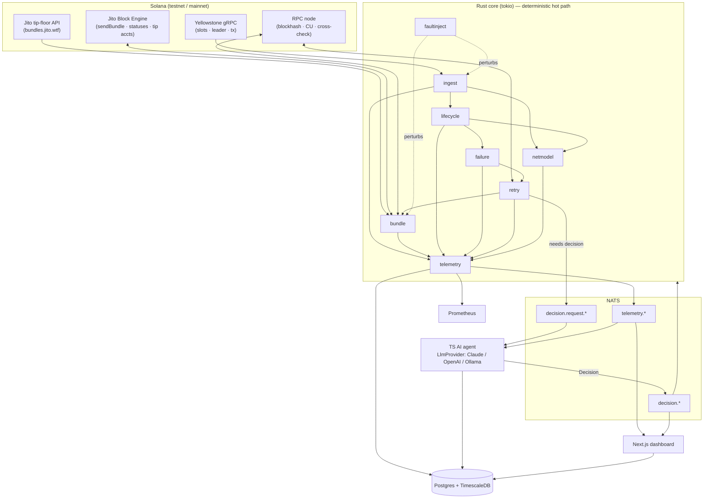
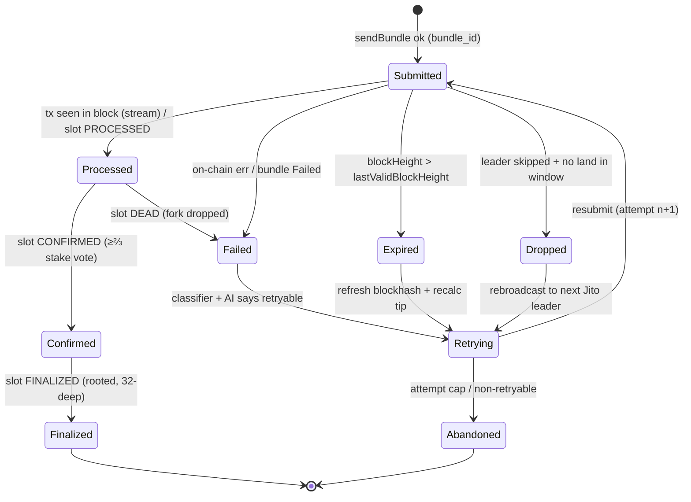
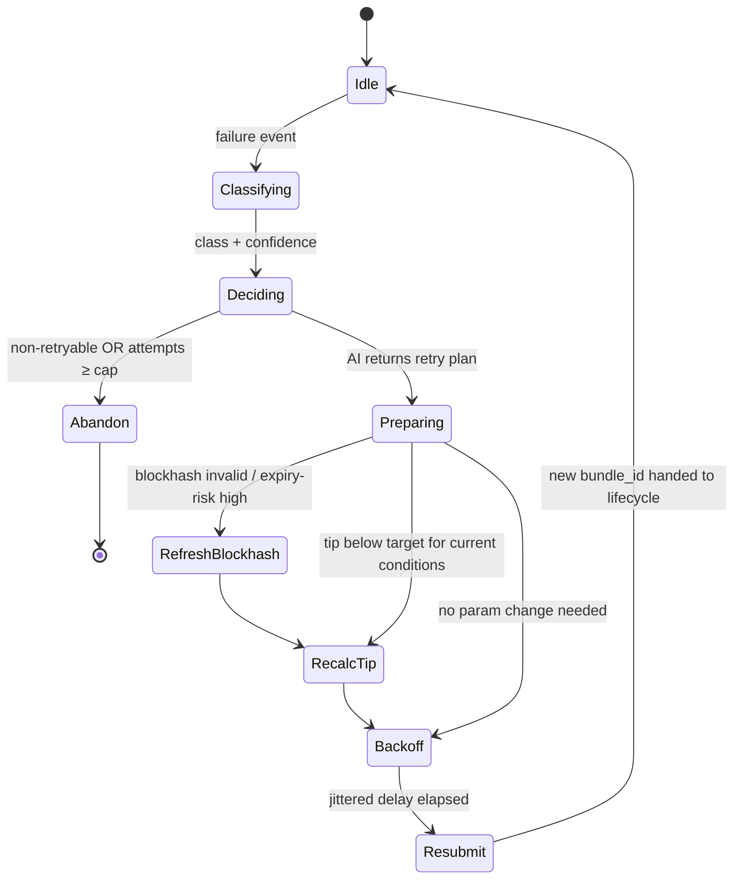
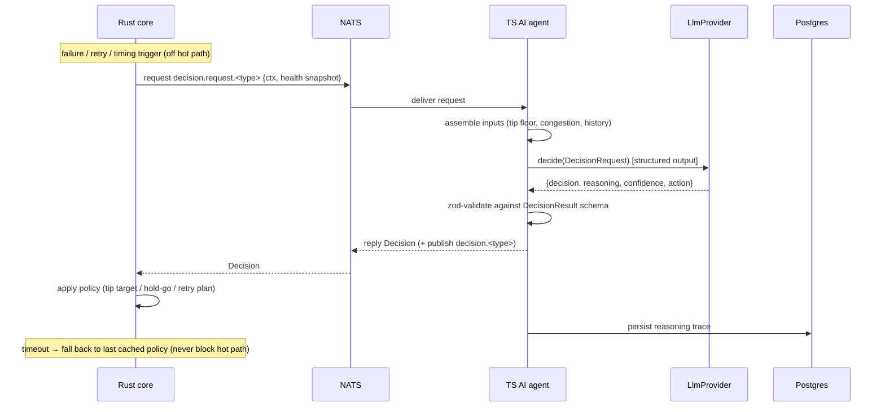
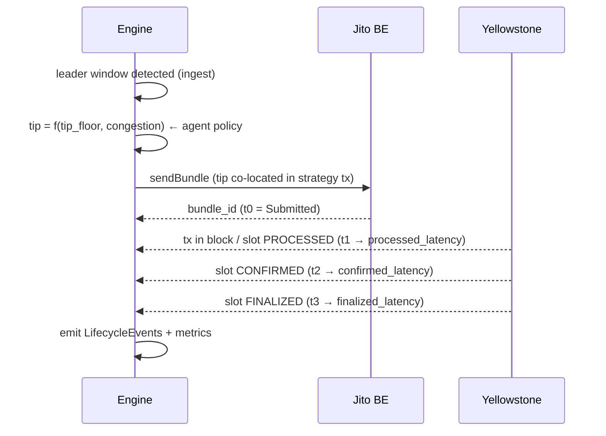

# PrometheonOS — Diagrams

Mermaid diagrams (render on GitHub). These are the canonical source for the figures in the public
architecture document. Marked _(target)_ where they describe behaviour implemented in a later phase.

---

## 1. System context / data flow

---

## 2. Transaction lifecycle state machine _(target — Phase 3)_

Driven primarily by the Yellowstone stream (slot status + tx status); RPC is a cross-check.

Each transition records `{slot, ts, delta_ms_from_prev}` → `LifecycleEvent`.

---

## 3. Retry orchestrator state machine _(target — Phase 6; RFC 0003)_

Every entry into `Resubmit` is justified by a persisted AI `Decision` (no hardcoded retry flow).

---

## 4. AI decision pipeline _(target — Phase 5)_

---

## 5. Event flow timeline (single bundle, happy path) _(target)_

