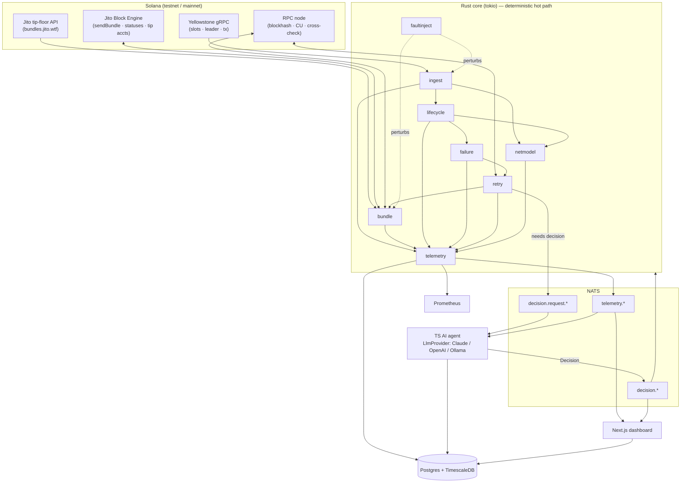
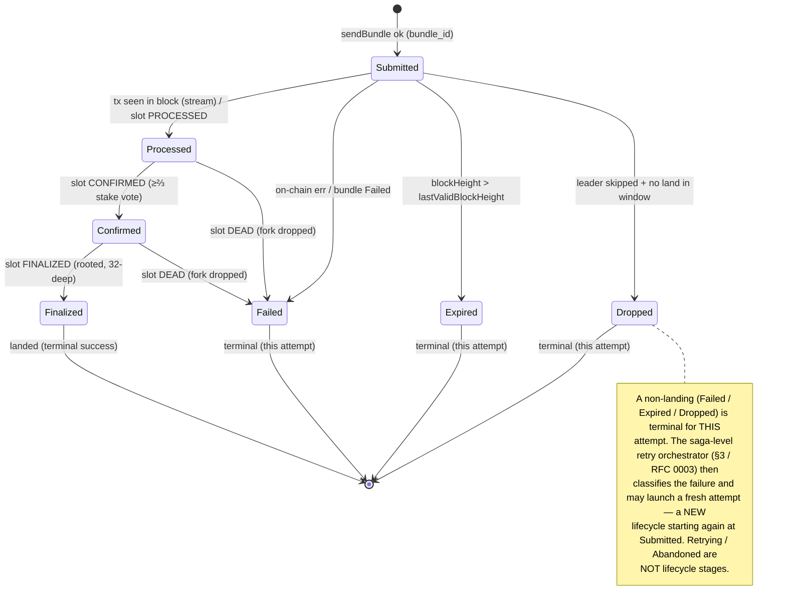
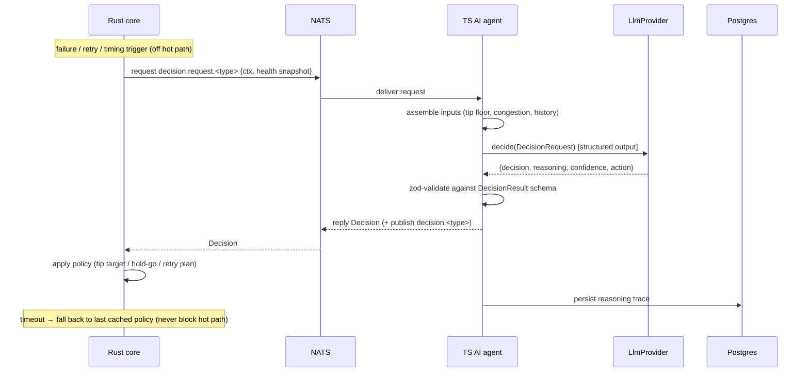
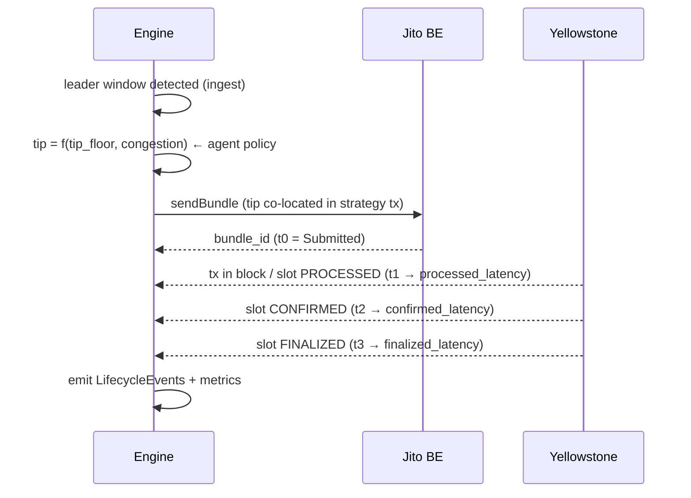

# PrometheonOS — Diagrams

Mermaid diagrams (render on GitHub). These are the canonical source for the figures in the public
architecture document — all reflect the implemented system.

---

## 1. System context / data flow

---

## 2. Transaction lifecycle state machine

Driven primarily by the Yellowstone stream (slot status + tx status); RPC is a cross-check.

Each transition records `{slot, ts, delta_ms_from_prev}` → `LifecycleEvent`. Forward-skips
(e.g. `Submitted → Confirmed`, `Processed → Finalized`) are accepted when the stream delivers a
later commitment without the intermediate one; backward/illegal transitions are rejected.

Retry is orchestrated at the saga level (see §3 / RFC 0003), not as a lifecycle stage.

---

## 3. Retry orchestrator — the saga loop (RFC 0003)

A *model* of the real saga loop in `crates/prometheon-core/src/saga.rs` (`run_saga` →
`reconcile` → `fail_and_retry` → `resolve_retry` → `launch`). The "state" is per-base bookkeeping
over the one shared Yellowstone stream, not an enum — see RFC 0003.

```mermaid
stateDiagram-v2
  [*] --> InFlight: launch attempt (Submitted)
  InFlight --> Landed: reached confirmed (drains to finalized)
  Landed --> [*]

  InFlight --> Classify: non-landing (failed tx-status OR give-up watermark)
  Classify --> Decide: FailureClass (probe_failure → real RPC/Jito signals; else heuristic)
  Decide --> Resolve: emit Failure, ask AI for Decision over NATS (None → deterministic policy)
  Resolve --> Abandon: attempt cap OR non-retryable class
  Resolve --> Launch: retry plan (forced refresh-on-expiry; AI tip, clamped)
  Launch --> InFlight: attempt n+1 (new bundle_id, Submitted)
  Abandon --> [*]
```

Every resubmit is justified by a persisted AI `Decision`; the forced refresh-on-expiry and the
attempt cap are deterministic safety the model cannot remove. Modeled as a saga over injectable
traits (RFC 0003), regression-tested with no network in `tests/saga_pipeline.rs`.

---

## 4. AI decision pipeline

---

## 5. Event flow timeline (single bundle, happy path)

